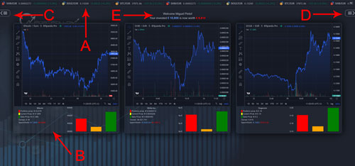

# 1. Contents
1. [Contents](README.md#1-contents)
2. [PortFollow](README.md#2-portfollow)
    * [Live page](README.md#live-page) 
3. [Installation](README.md#3-installation)
4. [Usage](README.md#4-usage)
    * [User interface](README.md#user-interface) 
        * [Price ticker](README.md#price-ticker)
        * [Asset charts](README.md#asset-charts)
        * [Asset menu](README.md#asset-menu)
        * [Setings menu](README.md#settings-menu)
        * [General portfolio information](README.md#general-portfolio-information)
5. [To do list](README.md#5-to-do-list)
6. [Known issues](README.md#6-known-issues)
7. [Remarks](README.md#7-remarks)
8. [Version](README.md#8-version)
9. [License](README.md#9-license)      
        
# 2. PortFollow
PortFollow allows you to keep track of your portfolio of financial assets.

* ## [Live page](http://portfollow.miguelpinto.dx.am/login.php)

# 3. Installation
Clone or Download.

# 4. Usage
Let's say you own a few cryptocoins and you want to keep track of how well theyre doing. Let's imagine you have made 3 transactions in the past - you bought 0.1 Bitcoin at a price of €38000, then you bought 0.5 Ethereum at €2000, and a few days later you sold 0.5 Ethereum when the price was €2100. With PortFollow you now have a way of keeping track of all this by creating records of each transaction (coin, amount, price, transaction type - sale/purchase).
You are then presented with charts and statistics about your portfolio which make it easy for you to visualise price fluctuations, comparisons, and trends.

* ## User interface

- A - Price ticker
- B - Asset charts
- C - Asset menu
- D - Settings menu
- E - General portfolio information

* ### Price ticker
This is where you'll see a real-time display of the market price of each of your selected asset.

* ### Asset charts
This is a detailed view of each of your selected assets. The main chart shows you the asset price during the time period selected. There are multiple tools which can be used on this chart, especially the desktop version.
If you own any amount of this asset, you will have a smaller chart on the botom right. This shows three values: in red you have the averaged price of each asset of this type in your portfolio based on the prices you paid on each transaction, in yellow you have the current market price of this asset, and in green you have the price this asset should reach in order for you to make a sale profit after paying transaction fees (this sale price is calculated at 10% over the average portfolio price).
On the bottom left there are the figures for these three charts, the total amount owned, and a comparison of how much was spent on what you own and what this is currently worth.

* ### Asset menu
This is where you are able to choose which assets to monitor. Choose from the list, add, remove, reorder. Then click update and the details for the chosen assets will be displayed both on the ticker and the big graphs.

* ### Setings menu
You can change several settings here. The site language, your time zone, currency used, your name, your asset transactions, delete your account, and logout.

* ### General portfolio information
Here you are shown the total amount of money you spent on your currently owned assets and its current worth.

# 5. To do list
* Add a Help section on the site itself.
* Add other type of commodities such as stocks for example - an API needs to be found which responds with real time market prices.
* Add price alerts.
* Add option to change registered email address.
* Add option to view characters when typing in a password.

# 6. Known issues
* Required input fields display a default system error message that is in English even when the user's selected language is a different language.
* Fear and Greed Index is not updating real time.

# 7. Remarks
___The database.php file (on the "includes" folder) does not contain database details for obvious reasons. For the site to be functional this needs to be added.___

# 8. Version
1.0

# 9. License

[MIT License](LICENSE)
